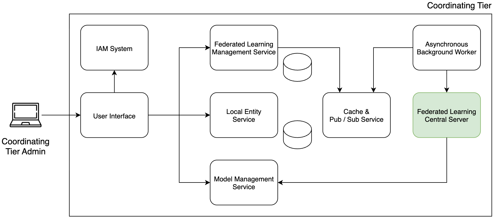
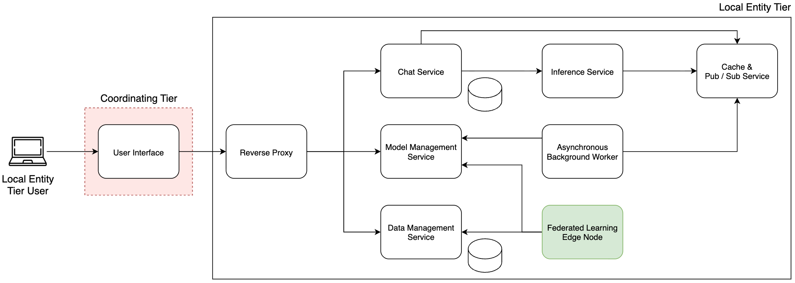

# PETAL (Privacy preserving Edge Training with Adapter Learning)

A federated learning platform that enables multiple institutes to collaboratively fine-tune a shared LLM without ever sharing their private data. Each institute trains locally; only model updates travel over the network. A central department node orchestrates the federation, tracks experiments, and manages model versions.

---

## Architecture

The system is split into two logical tiers.

### Department (central node)

Hosts the federation orchestrator, experiment tracking, institute registry, and the shared frontend.



### Institute (per-institute node)

Each institute runs its own stack: local data, inference, chat, and a Flower SuperNode that connects back to the department SuperLink.



---

## Global Requirements

Make sure the following tools are installed on your machine before proceeding.

| Tool                         | Purpose                                        | Install                                                                                                                         |
|------------------------------|------------------------------------------------|---------------------------------------------------------------------------------------------------------------------------------|
| **Docker** (with Compose v2) | Run all services                               | [docs.docker.com](https://docs.docker.com/get-docker/)                                                                          |
| **uv**                       | Python package manager (replaces pip/venv)     | [docs.astral.sh/uv](https://docs.astral.sh/uv/getting-started/installation/)                                                    |
| **Node.js + npm**            | Frontend development                           | [nodejs.org](https://nodejs.org/)                                                                                               |
| **NVIDIA GPU + drivers**     | Required for training and inference containers | [nvidia.com/drivers](https://www.nvidia.com/Download/index.aspx)                                                                |
| **NVIDIA Container Toolkit** | Expose GPU to Docker                           | [docs.nvidia.com/datacenter/cloud-native](https://docs.nvidia.com/datacenter/cloud-native/container-toolkit/install-guide.html) |

---

## Repository Structure

```
decentralised-ai/
├── department/                  # Department-side microservices
│   ├── federated-learning-management-service/
│   ├── institute-service/
│   └── mlflow-service/
├── institute/                   # Institute-side microservices
│   ├── chat-service/
│   ├── data-service/
│   ├── inference-service/
│   ├── model-service/
│   └── nginx-service/
├── federated-learning-service/  # Flower ClientApp + ServerApp
├── frontend/                    # React + TypeScript + Vite web UI
├── shared-auth-library/         # Shared JWT/OIDC library
├── misc/                        # Utility scripts (model downloader)
├── models/                      # Local model storage (gitignored)
│   ├── department/              # Department model files
│   └── institute/               # Per-institute model files
├── docker/                      # Docker Compose files
├── deployment/                  # Deployment scripts and API sync tools
├── keycloak-initial-configuration/  # Keycloak realm import files
└── docs/                        # Documentation and screenshots
```

---

## Base Model Download

> Do this first. The model files are large (~13 GB) and are not included in the repository.

```bash
cd ./misc
```

Install dependencies:

```bash
uv sync
```

Create the `.env` file from the template and fill in your values:

```bash
cp .env.template .env
```

```dotenv
HUGGINGFACE_TOKEN=hf_...        # Your Hugging Face access token
MODEL_PATH=../models/department  # Where the model will be saved
HF_MODEL_ID=meta-llama/Llama-2-7b-chat-hf
```

> **Hugging Face setup:**
> 1. Create an account at [huggingface.co](https://huggingface.co) and generate an access token at [huggingface.co/settings/tokens](https://huggingface.co/settings/tokens).
> 2. Request access to the model at [huggingface.co/meta-llama/Llama-2-7b-chat-hf](https://huggingface.co/meta-llama/Llama-2-7b-chat-hf). Meta will approve the request.

Download the model:

```bash
uv run --env-file .env src/huggingface_model_downloader.py
```

Remove symlinks so Docker can bind-mount the files correctly (your snapshot hash will differ):

```bash
./model_remove_symlinks.sh ../models/department/original/models--meta-llama--Llama-2-7b-chat-hf/snapshots/<snapshot-hash>
```

After the download and symlink removal, `./models/department/` should contain:

```
models/department/llama-2-7b/
└── base/
    ├── config.json
    ├── generation_config.json
    ├── model.safetensors.index.json
    ├── model-00001-of-00002.safetensors
    ├── model-00002-of-00002.safetensors
    ├── special_tokens_map.json
    ├── tokenizer.json
    └── tokenizer_config.json
```

---

## Quick Start (Docker)

The fastest way to bring up the full system. All services run as Docker containers.

### 0. Prerequisites

**Ensure `shared-auth-library` is published to the GitLab registry**

All Python services pull `shared-auth-library` from the internal GitLab PyPI registry when running in Docker. Make sure it has been published before building any image. See [shared-auth-library/README.md](shared-auth-library/README.md).

Also verify that every service's `pyproject.toml` has the GitLab index active (not the local path):

```toml
[tool.uv.sources]
# shared-auth-library = { path = "../../shared-auth-library" }  ← must be commented out
shared-auth-library = { index = "gitlab" }
```

---

**Build and install the Flower FAB**

The FL Management Service needs the federated learning app pre-installed before it can start fine-tuning jobs. Do this once (and again whenever `federated-learning-service` changes):

```bash
# 1. Build the FAB from the federated-learning-service
cd federated-learning-service
uv sync
flwr build
```

This produces a file named `luca-fanto.federated-learning-service.<version>.fab` in the current directory.

```bash
# 2. Copy the .fab into the FL management service
cp luca-fanto.federated-learning-service.*.fab \
   ../department/federated-learning-management-service/flwr/fab/
```

```bash
# 3. Install the FAB so Flower can find the app
cd ../department/federated-learning-management-service/flwr
flwr install fab/luca-fanto.federated-learning-service.<version>.fab --flwr-dir .
```

This creates the app directory under `./apps/luca-fanto.federated-learning-service.<version>/`.

```bash
# 4. Copy the federated-learning-service pyproject.toml into the installed app
cp ../../../federated-learning-service/pyproject.toml \
   apps/luca-fanto.federated-learning-service.<version>/pyproject.toml
```

> Replace `<version>` with the actual version string (e.g. `0.1.0`). After step 3 you can check the exact folder name with `ls apps/`.

---

### 1. Department stack

```bash
cd department/docker
cp .env.template .env
# fill in passwords and Keycloak credentials
```

```bash
docker compose -f ../../docker/docker-compose.department.yml --env-file .env up -d
```

### 2. Institute stack

```bash
cd institute/docker
cp .env.template .env
# fill in database passwords
```

```bash
docker compose -f ../../docker/docker-compose.institute.yml --env-file .env up -d
```

See [`docs/README_USE_PORTS.md`](docs/README_USE_PORTS.md) for the full port reference.

---

## Development Guide

Run each microservice locally for development. Services talk to each other over `localhost`; only the infrastructure (databases, Redis, Keycloak) runs in Docker.

### Prerequisites: build the shared auth library

All Python services depend on `shared-auth-library`. For local development you install it from a local path instead of the GitLab registry.

```bash
cd shared-auth-library
uv sync
uv build
```

See [shared-auth-library/README.md](shared-auth-library/README.md) for details.

---

### Prerequisites: sync the frontend API clients

The frontend uses auto-generated TypeScript clients built from each service's OpenAPI spec. Run the sync script once before starting the frontend (and again whenever a service API changes):

```bash
cd deployment/apis
./sync-dev-apis.sh
```

---

### Department layer

#### Step 1: start the department infrastructure

Start the local Docker Compose for the department. This brings up Keycloak, Redis, and the two MySQL databases (no application services):

```bash
cd department/docker
cp .env.template .env
# fill in passwords
docker compose -f docker-compose.local.yml --env-file .env up -d
```

#### Step 2: configure Keycloak

Once the infrastructure is up, Keycloak is available at `http://localhost:8086`. Log in with the admin credentials you set in `.env` (`KEYCLOAK_ADMIN` / `KEYCLOAK_ADMIN_PASSWORD`).

You need to create a realm and import the `spa-client` into it so the frontend can authenticate.

**Create the Department realm**

1. Open `http://localhost:8086` and log in as admin.
2. Click the realm dropdown (top-left) → **Create realm**.
3. Name it `Department` (this must match `REALM_NAME` in each service's `.env.dev`).

**Import the spa-client**

1. Inside the `Department` realm, go to **Clients** → **Import client**.
2. Upload the file [`docs/keycloak-spa-client-configuration/example-department-spa-client.json`](docs/keycloak-spa-client-configuration/example-department-spa-client.json).
3. Save.

The imported client is a **public OpenID Connect** client (`spa-client`) with:
- PKCE enabled (`S256`)
- Redirect URI and web origin set to `http://localhost:3000`
- A hardcoded `realm_admin: true` claim added to the access token (used by the department frontend to identify admin users)

> For production, update the redirect URIs and web origins to match your actual frontend URL.

**Create users**

Add at least one user inside the `Department` realm so you can log in through the frontend.

---

#### Step 3: start department microservices

Start each service individually. Click the links below to go to each service's README for the full setup steps:

- [MLflow Service](department/mlflow-service/README.md)
- [Institute Service](department/institute-service/README.md)
- [Federated Learning Management Service](department/federated-learning-management-service/README.md)

Each service README explains how to:
1. Switch `pyproject.toml` to use the local `shared-auth-library` path
2. Create the `.env.dev` file from its template
3. Run `uv sync` and start the service

---

### Institute layer

#### Step 1: start the institute infrastructure

```bash
cd institute/docker
cp .env.template .env
# fill in passwords
docker compose -f docker-compose.local.yml --env-file .env up -d
```

This starts Redis and the two MySQL databases (documents + chats).

#### Step 2: configure Keycloak for the institute

Each institute has its own realm in the same Keycloak instance (running on the department node at `http://localhost:8086`).

**Create the institute realm**

1. Open `http://localhost:8086` and log in as admin.
2. Click the realm dropdown → **Create realm**.
3. Name it after the institute (e.g. `ISIN`). This must match `REALM_NAME` in the institute services' `.env.dev` files.

**Import the spa-client**

1. Inside the institute realm, go to **Clients** → **Import client**.
2. Upload the file [`docs/keycloak-spa-client-configuration/example-institute-spa-client.json`](docs/keycloak-spa-client-configuration/example-institute-spa-client.json).
3. Save.

The imported client is a **public OpenID Connect** client (`spa-client`) with:
- PKCE enabled (`S256`)
- Redirect URI and web origin set to `http://localhost:3000`

> The institute client has no `realm_admin` claim - that claim is department-only.

**Create users**

Add at least one user inside the institute realm so institute users can log in through the frontend.

#### Step 3: start institute microservices

- [Data Service](institute/data-service/README.md)
- [Model Service](institute/model-service/README.md)
- [Chat Service](institute/chat-service/README.md)
- [Inference Service](institute/inference-service/README.md)

---

### Frontend

Once all backend services are running:

- [Frontend README](frontend/README.md)

The dev server starts at `http://localhost:3000`.

---

## Port Reference

See [`docs/README_USE_PORTS.md`](docs/README_USE_PORTS.md) for the full port registry.

---

## Running Tests

For any Python service:

```bash
cd <service-directory>
uv sync
source .venv/bin/activate
uv run pytest
```

For the frontend:

```bash
cd frontend
npm install
npm run test
```
