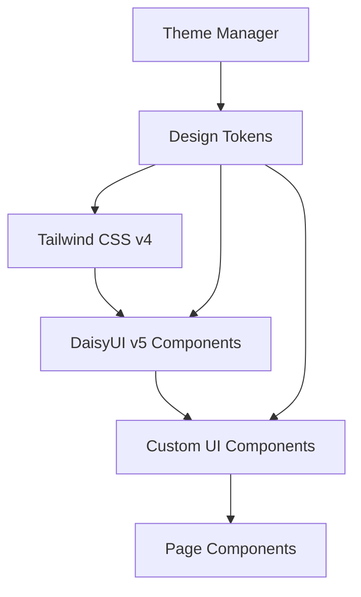

# Design Document: UI/UX Visual Refactor

## Overview

This design document specifies the technical implementation for a comprehensive visual refactor of the React + TypeScript frontend application. The refactor transforms the interface into a modern, enterprise-grade SaaS application while preserving all existing business logic, API integrations, authentication flows, and component structure.

### Design Goals

1. **Visual Excellence**: Create a clean, formal, elegant interface that feels immediately intuitive
2. **Design System Consistency**: Implement a cohesive design language using Tailwind CSS v4 and DaisyUI v5
3. **Zero Business Logic Changes**: Preserve all hooks, API calls, routing, authentication, and state management
4. **Accessibility First**: Ensure WCAG AA compliance and full keyboard navigation support
5. **Responsive Design**: Support mobile (≥320px), tablet (≥768px), desktop (≥1280px), and wide (≥1920px) viewports
6. **Smooth Animations**: Implement polished micro-interactions using Framer Motion v12
7. **Internationalization**: Maintain full i18n support with react-i18next

### Scope

**In Scope:**
- Visual styling and component presentation
- Layout structure and responsive behavior
- Animation and motion design
- Theme management (dark/light)
- Reusable UI component library
- Design system configuration

**Out of Scope:**
- Business logic modifications
- API client changes
- Authentication flow changes
- Routing modifications
- New npm package installations
- File structure reorganization

## Architecture

### High-Level Architecture

The application follows a layered architecture with clear separation between presentation and business logic:

```
┌─────────────────────────────────────────────────────────┐
│                    Presentation Layer                    │
│  (Visual Components, Layouts, Animations, Themes)       │
├─────────────────────────────────────────────────────────┤
│                    Business Logic Layer                  │
│  (Hooks, API Calls, State Management, Auth)             │
│                   [PRESERVED - NO CHANGES]               │
├─────────────────────────────────────────────────────────┤
│                    Service Layer                         │
│  (API Clients, OIDC, Data Fetching)                     │
│                   [PRESERVED - NO CHANGES]               │
└─────────────────────────────────────────────────────────┘
```

### Component Hierarchy

```
App
├── Toaster (React Hot Toast)
├── NavigationShell
│   ├── TopNavbar
│   │   ├── HamburgerToggle
│   │   ├── AppLogo
│   │   ├── InstituteBadge
│   │   ├── LanguageSwitcher
│   │   ├── ThemeToggle
│   │   └── UserProfileMenu
│   ├── Sidebar (Desktop/Tablet)
│   │   ├── NavigationItems
│   │   └── SidebarFooter
│   ├── DrawerOverlay (Mobile)
│   │   └── NavigationItems
│   └── MainContent
│       └── PageComponent
│           ├── PageHeader
│           ├── LoadingState / ErrorState / Content
│           └── Modals
└── Footer
```

### Design System Architecture

The design system is built on three layers:

1. **Foundation Layer**: Tailwind CSS v4 utility classes
2. **Component Layer**: DaisyUI v5 base components
3. **Custom Layer**: Application-specific components and patterns



## Components and Interfaces

### Core UI Components

#### 1. NavigationShell

**Purpose**: Top-level layout wrapper providing consistent navigation structure across all pages.

**Props Interface**:
```typescript
interface NavigationShellProps {
  children: React.ReactNode;
}
```

**Responsibilities**:
- Render top navbar with all controls
- Manage sidebar visibility and collapse state
- Handle responsive layout transitions
- Provide main content container

**State Management**:
```typescript
interface NavigationShellState {
  sidebarCollapsed: boolean;
  drawerOpen: boolean;
}
```

#### 2. ThemeToggle

**Purpose**: Toggle between dark and light themes with persistence.

**Props Interface**:
```typescript
interface ThemeToggleProps {
  className?: string;
}
```

**Responsibilities**:
- Read theme from localStorage on mount
- Detect OS preference if no saved theme
- Update html data-theme attribute
- Persist theme changes to localStorage
- Animate icon transitions

**State Management**:
```typescript
type Theme = 'light' | 'dark';

interface ThemeState {
  currentTheme: Theme;
}
```

#### 3. InstituteBadge

**Purpose**: Display the institute name in the navbar.

**Props Interface**:
```typescript
interface InstituteBadgeProps {
  instituteName: string;
  className?: string;
}
```

**Responsibilities**:
- Display institute name with Building2 icon
- Truncate long names with ellipsis
- Show full name in tooltip on hover
- Apply theme-appropriate styling

#### 4. DeleteConfirmModal

**Purpose**: Reusable confirmation dialog for destructive actions.

**Props Interface**:
```typescript
interface DeleteConfirmModalProps {
  isOpen: boolean;
  onConfirm: () => void;
  onCancel: () => void;
  itemName?: string;
}
```

**Responsibilities**:
- Display warning icon and translated message
- Prevent background interaction when open
- Handle Escape key and overlay click to cancel
- Animate entrance and exit
- Execute callback on confirmation

#### 5. PageHeader

**Purpose**: Consistent page header with title, subtitle, and optional CTA.

**Props Interface**:
```typescript
interface PageHeaderProps {
  icon?: React.ComponentType<{ size?: number }>;
  title: string;
  subtitle?: string;
  action?: {
    label: string;
    icon?: React.ComponentType<{ size?: number }>;
    onClick: () => void;
  };
}
```

#### 6. EmptyState

**Purpose**: Display when no data is available.

**Props Interface**:
```typescript
interface EmptyStateProps {
  icon: React.ComponentType<{ size?: number }>;
  title: string;
  description?: string;
  action?: {
    label: string;
    onClick: () => void;
  };
}
```

#### 7. LoadingSkeleton

**Purpose**: Display loading state matching content layout.

**Props Interface**:
```typescript
interface LoadingSkeletonProps {
  variant: 'list' | 'card' | 'table';
  count?: number;
}
```

#### 8. StatusBadge

**Purpose**: Display status with color-coded badge.

**Props Interface**:
```typescript
interface StatusBadgeProps {
  status: string;
  variant?: 'success' | 'error' | 'warning' | 'info' | 'neutral';
}
```

### Page Component Structure

Each page component follows this structure:

```typescript
interface PageComponentStructure {
  // Data fetching (preserved from existing code)
  dataHooks: {
    useQuery: any;
    useMutation: any;
  };
  
  // Local UI state only
  uiState: {
    searchQuery?: string;
    modalOpen?: boolean;
    selectedItem?: any;
  };
  
  // Render structure
  render: {
    pageHeader: PageHeader;
    content: LoadingState | ErrorState | DataContent;
    modals?: Modal[];
  };
}
```

## Data Models

### Theme Configuration

```typescript
interface ThemeConfig {
  light: {
    background: '#F8F9FB';
    surface: '#FFFFFF';
    primary: '#4F46E5';
    primaryHover: '#4338CA';
    text: '#1E293B';
    textSecondary: '#64748B';
    border: '#E2E8F0';
  };
  dark: {
    background: '#0F1117';
    surface: '#1A1D27';
    primary: '#6366F1';
    primaryHover: '#818CF8';
    text: '#F8FAFC';
    textSecondary: '#94A3B8';
    border: '#334155';
  };
}
```

### Typography System

```typescript
interface TypographySystem {
  fonts: {
    heading: 'Plus Jakarta Sans';
    body: 'DM Sans';
    mono: 'JetBrains Mono';
  };
  weights: {
    heading: [600, 700];
    body: [400, 500];
    mono: [400];
  };
  sizes: {
    xs: '0.75rem';    // 12px
    sm: '0.875rem';   // 14px
    base: '1rem';     // 16px
    lg: '1.125rem';   // 18px
    xl: '1.25rem';    // 20px
    '2xl': '1.5rem';  // 24px
    '3xl': '1.875rem'; // 30px
    '4xl': '2.25rem'; // 36px
  };
}
```

### Spacing System

```typescript
interface SpacingSystem {
  card: 'p-6';           // 24px
  compactPanel: 'p-4';   // 16px
  section: 'space-y-6';  // 24px vertical
  element: 'gap-4';      // 16px gap
  tight: 'gap-2';        // 8px gap
}
```

### Border Radius System

```typescript
interface BorderRadiusSystem {
  card: 'rounded-xl';      // 12px
  button: 'rounded-lg';    // 8px
  input: 'rounded-lg';     // 8px
  badge: 'rounded-full';   // 9999px
  modal: 'rounded-2xl';    // 16px
}
```

### Icon Sizing System

```typescript
interface IconSizingSystem {
  badge: 14;
  button: 16;
  navItem: 18;
  mobileNav: 20;
  emptyState: 24;
  pageHeader: 32;
}
```

### Animation Variants

```typescript
interface AnimationVariants {
  pageEntrance: {
    initial: { opacity: 0, y: 12 };
    animate: { opacity: 1, y: 0 };
    transition: { duration: 0.25 };
  };
  
  modalEntrance: {
    initial: { opacity: 0, scale: 0.95 };
    animate: { opacity: 1, scale: 1 };
    transition: { duration: 0.2 };
  };
  
  listStagger: {
    container: {
      animate: { transition: { staggerChildren: 0.05 } };
    };
    item: {
      initial: { opacity: 0, y: 8 };
      animate: { opacity: 1, y: 0 };
    };
  };
  
  cardHover: {
    whileHover: { y: -2, transition: { duration: 0.2 } };
  };
  
  sidebarCollapse: {
    transition: { duration: 0.3, ease: 'easeInOut' };
  };
}
```

### Responsive Breakpoints

```typescript
interface ResponsiveBreakpoints {
  mobile: '320px';   // min-width
  tablet: '768px';   // md:
  desktop: '1280px'; // lg:
  wide: '1920px';    // xl:
}

interface ResponsiveBehavior {
  sidebar: {
    mobile: 'drawer overlay';
    tablet: 'collapsed icon-only (w-16)';
    desktop: 'expanded with labels (w-64)';
  };
  
  padding: {
    mobile: 'p-4';
    desktop: 'p-6';
  };
  
  touchTargets: {
    mobile: 'min 44x44px';
  };
}
```

### Navigation Configuration

```typescript
interface NavigationItem {
  path: string;
  labelKey: string;
  icon: LucideIcon;
  protected: boolean;
  adminOnly?: boolean;
}

interface NavigationConfig {
  publicLinks: NavigationItem[];
  protectedLinks: NavigationItem[];
  departmentAdminLinks: NavigationItem[];
}
```

### Toast Configuration

```typescript
interface ToastConfig {
  position: 'bottom-right';
  duration: 4000;
  style: {
    light: {
      background: '#FFFFFF';
      color: '#1E293B';
      border: '1px solid #E2E8F0';
    };
    dark: {
      background: '#1A1D27';
      color: '#F8FAFC';
      border: '1px solid #334155';
    };
  };
}
```

